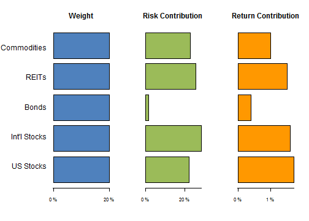

## Portfolio Risk Visualizer

- "Risk-based" investment strategies have proliferated over the past decade

- Many investors employ these strategies without understanding how they work

- The application [portfolioRiskViz](https://mcarlo.shinyapps.io/portfolioRiskViz/)
advances their understanding by illustrating how a portfolio's risk changes when
its asset weights change

---

## Side panel: play with portfolio allocations

- Sliders invite the user to change allocations among several investments 

+ Assets include

  - Commodities
  - REITs
  - Bonds
  - International Stocks
  - US Stocks

---

## Portfolio Composition panel: Reactive charts

- Resulting changes in risk contributions are nonlinear and therefore not
intuitive


```r
covariances <- correlations * (Volatility %*% t(Volatility))

contributions <- weights * (covariances %*% weights)
variance <- sum(contributions)
risk_contributions <- contributions/variance
```



---

## Non-reactive panels illustrate common portfolio strategies

- Non-reactive panels depict Portfolio Composition graphs for Minimum Variance, 
Maximum Sharpe Ratio, and Risk Parity portfolios

- Comments draw user's attention to features of these strategies not commonly
known outside the world of financial academics and quantitative portfolio
managers

- Assumptions panel lists assumptions for asset Volatilities, Expected Returns,
and a correlation matrix

- With these assumptions, a competent investment professional could easily
reproduce these results, whether in R, Excel, or any other platform

- Definitions panel clarifies mathematical definitions of terms used in the app
